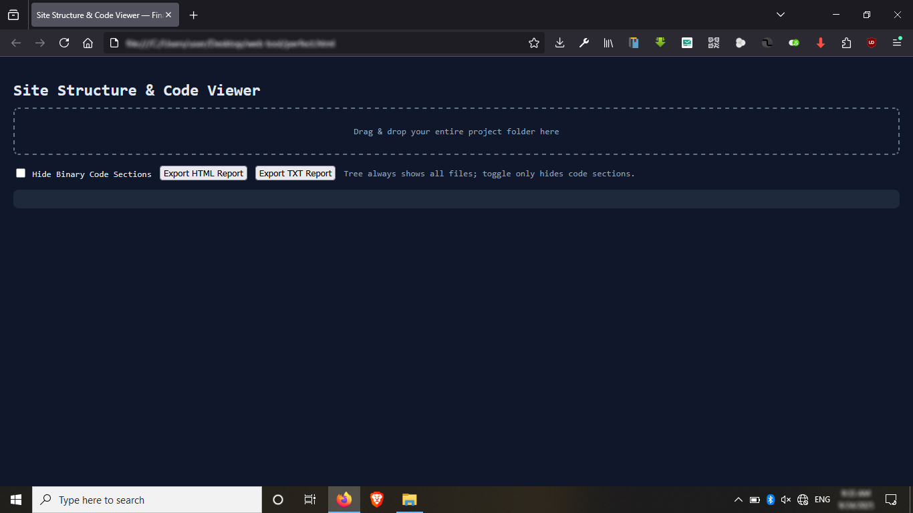
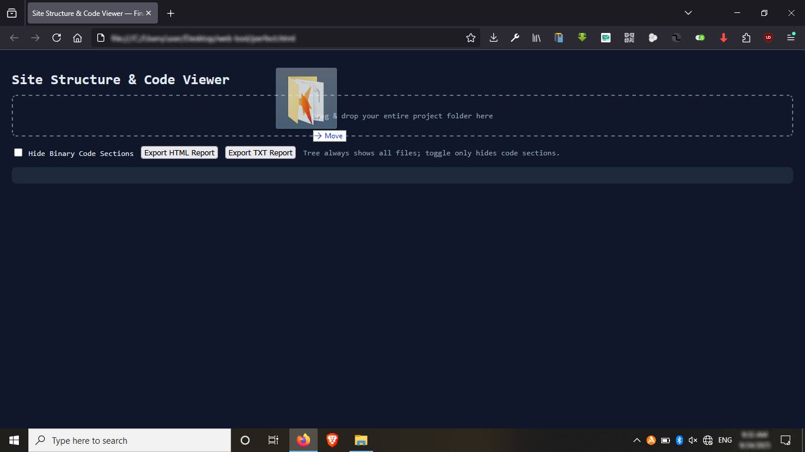
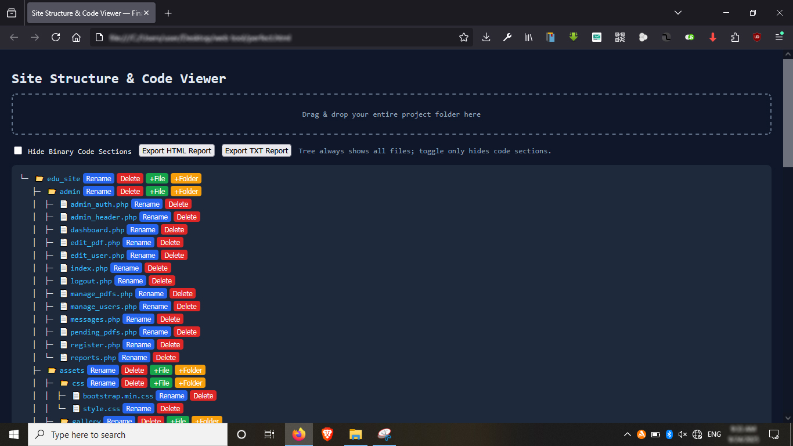
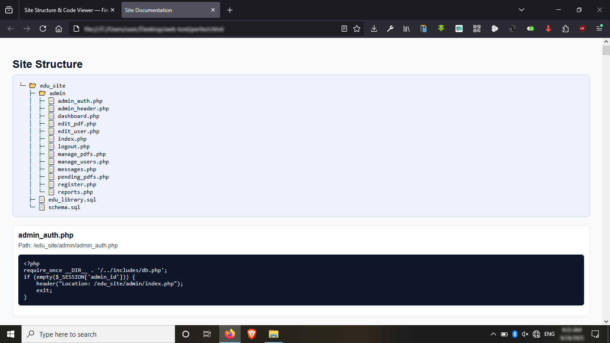
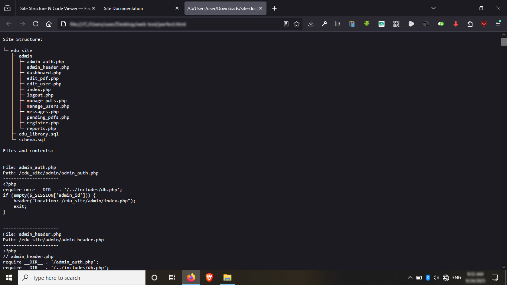

# Site to Report / Prompt Converter 🚀

**A free, offline, browser-based tool to view, document, and export your website or project in a client- and AI-friendly format.**  

## 🌐 Live Demo

Try the tool directly in your browser!  
👉 [Click here to see the live demo](https://nuwan-jk.github.io/site-to-report-prompt/)

---

## 🌟 Overview

This tool was created to solve a common developer pain:  

**👉 Easily show your client (or an AI assistant) the exact site structure and readable source code of your project.**

With this browser-based tool you can:

- Drag & drop your entire project folder.
- Instantly see the **site structure** in a clean, human-readable tree view.
- Click any file to view its **code or content**.
- Add, rename, and delete files/folders directly in the tree.
- Export the full site documentation as either:
  - **TXT file** (plain, AI-prompt-friendly format)
  - **HTML file** (beautiful, styled report to share with clients or colleagues)

No installation, no backend server, 100% client-side JavaScript.

---

## 🎯 Features

**Drag & Drop Project**  
Just drag your project folder into the page. The tool builds the structure automatically.

**Tree View**

- ASCII-style tree with branch lines.
- Inline icons for file types:
  - 📂 Folder
  - 📄 Text/code files
  - 🖼️ Images
  - 📑 PDFs/Documents
  - ⚙️ Other binaries

**Actions**

- **+File / +Folder** → create placeholders.  
- **Rename** → instantly rename (tracked in exports).  
- **Delete** → instantly remove (no confirmations).

**Binary Toggle**

- Tree always shows all files.  
- In code sections and reports:
  - **ON** → binary files are skipped (hidden).  
  - **OFF** → binary files are included as `[Binary file: not readable as text]`.

**Exports**

- **TXT Report**: clean ASCII tree + file contents, perfect for AI prompting.  
- **HTML Report**: styled export with tree and code blocks for clients or teams.

---

## 📂 File Types

**Readable (Human-Readable Code/Text)**

`.html, .htm, .css, .js, .php, .json, .txt, .md, .xml, .sql, .c, .cpp, .py, .rb, .java`

**Binary (Not Readable)**

Images: `.jpg, .jpeg, .png, .gif, .svg, .webp`  
Documents: `.pdf, .doc, .docx`  
Other non-readable files  

Binary files:

- Always appear in the tree.  
- Never show actual code.  
- Shown as `[Binary file: not readable as text]` (unless hidden via toggle).

---

## 🖥️ How to Use

1. Open `index.html` in your browser.  
2. Drag and drop your project folder into the drop zone.  
3. Explore the site structure in the tree view.  
4. Click files to view contents.  
5. Use buttons to:
   - Add files/folders  
   - Rename items  
   - Delete items  
6. Use **Hide Binary** checkbox to exclude binary files from reports.  
7. Click **Export TXT** or **Export HTML** to save full documentation.

---

## 💻 Screenshots

**First Page / Landing View:**  

**Drag & Drop Project:**  

**Code / File Preview:**  

**HTML Export:**  

**TXT Export:**  

---

## 📦 Why This Tool?

- **Client-Friendly:** show structure + code clearly.  
- **AI-Friendly:** share site structure + readable code with AI.  
- **Team-Friendly:** share HTML exports with colleagues.  
- **Offline & Free:** works 100% in the browser.

---

## ⚙️ Keywords

site structure, project viewer, code viewer, prompt converter, report exporter, drag & drop, offline, client-friendly, AI-friendly

---

## 📝 License

MIT License. See the `LICENSE` file for details.
